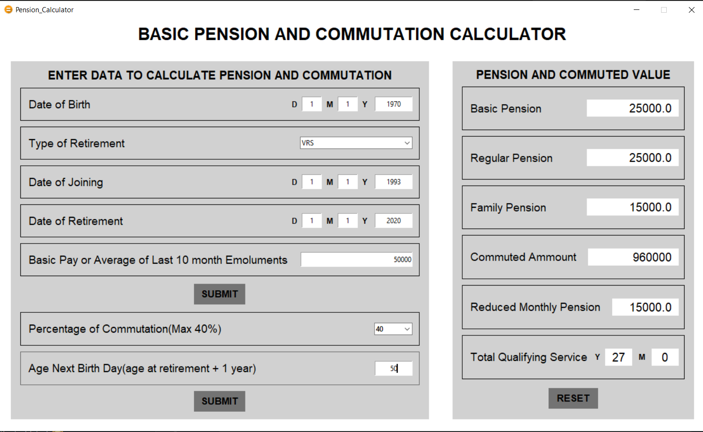

# Pension Calculator

A basic pension calualtor using python for INT213 :mortar_board:


## Getting Started
Clone the repository

```shell
git clone https://github.com/rokibulislaam/pension-calculator.git
```

Run the program in python
```shell
cd pension-calculator && python main.py
```

## Screenshots




## License

This project is under [MIT License](LICENSE)
